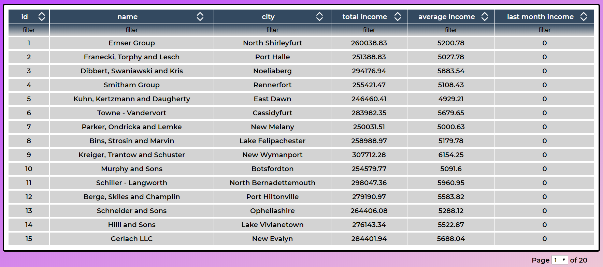

## Table of contents

- [General info](#general-info)
- [Technologies](#technologies)
- [Setup](#setup)
- [Features](#features)
- [Screenshot](#screenshot)

## General info

This app handles data from api and displays them in table.

## Technologies

Project is created with:

- react: 16.13.1
- react-dom: 16.13.1
- react-scripts: 3.4.1
- styled-components: 5.1.0
- eslint: 6.8.0
- eslint-config-airbnb: 18.1.0
- eslint-plugin-import: 2.20.1
- eslint-plugin-jsx-a11y: 6.2.3
- eslint-plugin-react: 7.19.0
- eslint-plugin-react-hooks: 2.5.0
- gh-pages: 2.2.0

Api used for project:
API prepared for reruitment purposes

## Setup

To run this project, install it locally using npm:

```
$ cd ../combanyble
$ npm install
$ npm start
```

## Features

- Click on header cell to sort items in column ascending, vlivk again to sorts descending, an so on
- Under each header cell is located Input which filter data from column below
- Under the table there is located page select, you can chose which page you want to see

## Screenshot


